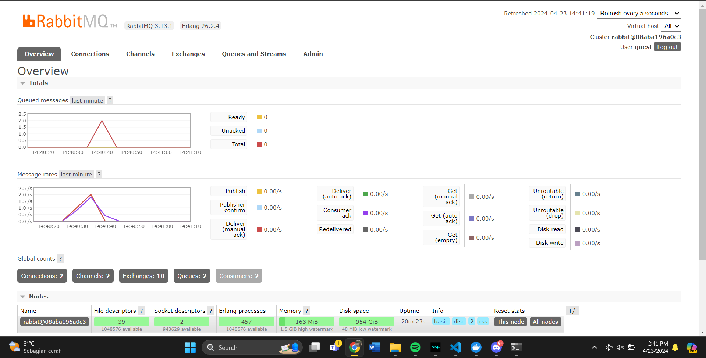
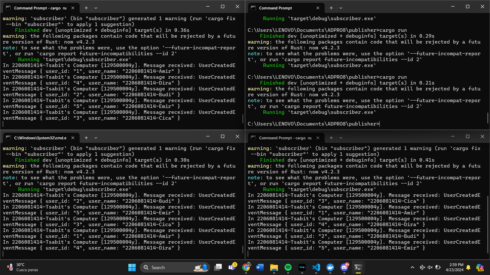
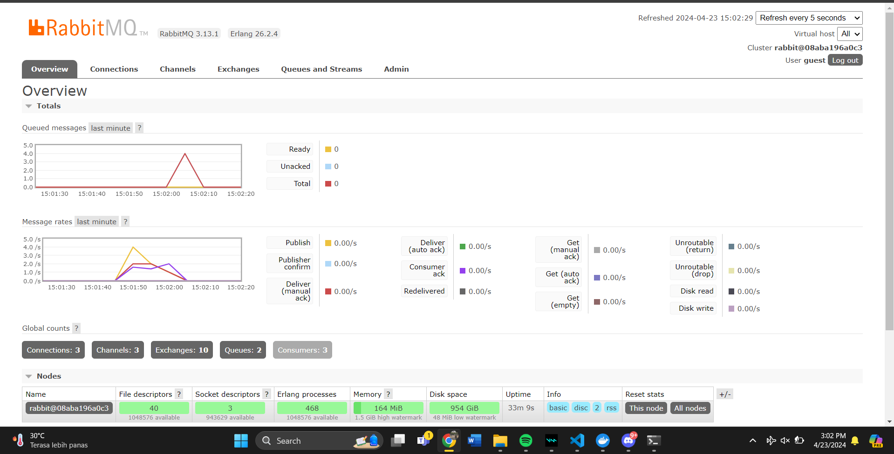

## QUESTION ADPRO 8

1. What is **AMQP**?

AMQP = Advanced Message Queuing Processing
Sesuai namanya, AMQP berfungsi untuk memroses pertukaran pesan antar software. Pada program ini, AMQP digunakan pada `main.rs` untuk mengatur pertukaran pesan

2. What it means? *guest:guest@localhost:5672* , what is the first guest, and what is the second guest, and what is localhost:5672 is for?

guest:guest memiliki format **pengguna**:**password**

`guest:guest@localhost:5672` termasuk kedalam URI broker AMQP

`localhost:5672` memproyeksikan host dan port yang akan dijalankan pada computer local. 5672 merupakan angka portnya.

Cargo run 4 kali mengakibatkan total queue yang terlihat pada tabel. Queue akan meningkat seiring dengan jumlah event yang didelay oleh subscriber sehingga mengakibatkan penumpukan

Penggunaan tiga konsol secara bersamaan membuat pembagian kerja terbagi rata sehingga meningkatkan efisiensi serta kinerja program. Melalui hal tersebut, spike queue pun akan ikut berkurang